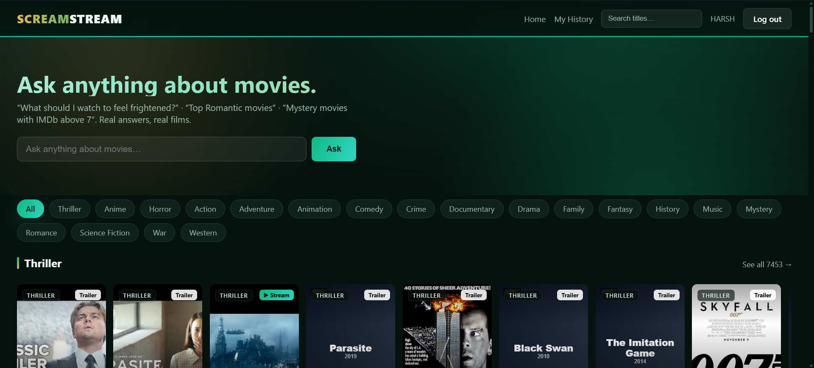

# ScreamStream 

A movie exploring web app: sign up, browse a **144,000-title**
catalog by genre, watch a title's YouTube trailer, and follow
"where to watch" links to the platforms that stream it. An **"Ask anything"**
box answers natural-language questions with real films from the catalog.

### 🔗 Live demo — **https://scream-stream.vercel.app**

> Hosted free on **Vercel** (serverless) with a **Neon** PostgreSQL database —
> effectively always-on, with no spin-down wait. Create an account to browse.



---

## Highlights

What makes this more than a CRUD demo:

- **Dual-mode database, one code path.** A small query-translation shim lets the
  exact same data-access code run on **SQLite** locally and **PostgreSQL** in
  production — switched purely by whether `DATABASE_URL` is set. No ORM, no
  separate prod/dev branches to drift apart.
- **144k-title catalog, built cheaply.** Movies are bulk-imported from IMDb's
  official datasets (no per-movie API calls). Expensive details — poster,
  trailer, full scores, cast, where-to-watch — are fetched **lazily on first
  open** and cached in the row, so the import stays fast and external APIs aren't
  hammered.
- **Respects rate limits by design.** A backfill script fills real posters
  **most-popular-first** (the order the grids actually render) within OMDb's
  daily cap, so the visible catalog looks complete first.
- **LLM grounded in the real catalog.** "Ask anything" sends the question to a
  free LLM, then matches the titles it names back against the local database — so
  every answer links to a real detail page, not a hallucinated one.
- **Graceful degradation.** Every external integration is optional; without a key
  the feature falls back to a simpler behaviour and the site still runs.
- **A living, catalog-driven backdrop.** Login and every page header are wallpapered
  with a slow drift of *real* posters pulled live from the most-popular rows of the
  database — animated purely in CSS, dimmed behind a readable veil, and stilled for
  anyone who sets `prefers-reduced-motion`. Versioned asset URLs guarantee the
  freshest stylesheet ships past the service-worker cache.

---

## Features

| | |
|---|---|
| **Accounts** | Register / log in; passwords stored only as salted hashes. |
| **Two-factor auth** | Optional TOTP 2FA — pair any authenticator app on top of the password. |
| **Account & privacy** | Email verification & password reset, "log out everywhere", one-click data export and account deletion. |
| **Huge catalog** | ~144k movies from IMDb datasets, organised into genre rows. |
| **Personalised home** | "Continue Watching", "Trending", "Because you like…" and "Coming Soon" rows, plus a 🎲 random pick. |
| **Rich metadata** | IMDb & Rotten Tomatoes scores, year, age rating, runtime, synopsis, cast, director. |
| **Trailers** | Plays a title's YouTube trailer when one is found, with a watch-on-YouTube fallback. |
| **Where to watch** | Region-aware streaming-provider links, shown for titles where data is available. |
| **Ratings & reviews** | Members rate any title and leave a review; the per-title average is shown. |
| **My List & history** | Save titles to a personal watchlist and revisit a dedicated watch-history page. |
| **Ask anything** | Plain-English movie questions answered with real catalog matches. |
| **Light & dark theme** | One-tap theme switch across the whole app. |
| **Installable PWA** | Add-to-home-screen with a service worker for fast, offline-friendly loads. |
| **Admin panel** | Add / remove / import movies and view a usage-analytics dashboard, behind a single admin account. |

---

## Tech stack

- **Python 3.12** · **Flask 3** · **Jinja2** — server-rendered; *no* JS framework.
- **SQLite** (dev) / **PostgreSQL via psycopg2** (prod, on **Neon**) — same code, dual-mode.
- **Werkzeug** password hashing (PBKDF2) · **Gunicorn** WSGI server.
- **HTML5 + a single hand-written CSS file** — no CSS framework; YouTube
  `<iframe>` for trailers; **installable PWA** (web manifest + service worker).
- **Data:** IMDb datasets (catalog) · OMDb (posters/scores) · YouTube (trailers) ·
  Streaming Availability API (where-to-watch) · Groq LLM (Ask anything) ·
  SMTP (account emails — verification & password reset).
- **Hosting:** Vercel (serverless Python) + Neon (managed PostgreSQL), configured by `vercel.json`.

---

## Run it locally

No build step — Python is interpreted; the only "build" is installing deps.

```bash
git clone https://github.com/Jyotishman89/ScreamStream.git
cd ScreamStream
python -m venv .venv && .venv\Scripts\Activate.ps1   # macOS/Linux: source .venv/bin/activate
pip install -r requirements.txt
cp .env.example .env        # optional: add API keys for posters / trailers / Ask-anything
python app.py
```

Open **http://127.0.0.1:5000**, create an account, and browse. The app creates
its tables and seeds a few sample titles on first run, so it works immediately.

**Load the full catalog** (optional):

```bash
python import_imdb.py 100     # import ~144k movies (arg = min vote count)
python backfill_posters.py    # fill real posters, most-popular-first
```

Configuration is via environment variables — see **`.env.example`** for the full
list (all optional; the app degrades gracefully without them).

---

## Deployment

Live on **Vercel** (serverless Python) backed by a free **Neon** PostgreSQL
database. The repo ships `vercel.json`, which points Vercel's Python runtime at
`app.py` and bundles the templates/static. The flow: create a Neon database,
load the catalog into it once with `python migrate_to_postgres.py`, then import
the repo on Vercel and set `DATABASE_URL` (the Neon connection string) plus your
API keys as environment variables. Full walkthrough:
**[`DEPLOY_VERCEL.md`](DEPLOY_VERCEL.md)**.

> Both Vercel (Hobby) and Neon's free tier have no time limit — the site stays
> live with no sleep, no memory cap, and no database expiry.

---

## Security & content notes

- **No credentials in the repo.** API keys, the admin username and all passwords
  live only in environment variables / the database — never committed.
- **Passwords hashed** with Werkzeug (PBKDF2); plaintext is never stored.
  Sessions are signed with `SECRET_KEY`. Flask debug is off unless explicitly enabled.
  Accounts can add **TOTP two-factor auth** for a second login step.
- **Content:** ScreamStream doesn't host or stream full films — each title
  links out to its YouTube trailer and to the platforms that stream it. Scores
  and years are real reference data.
